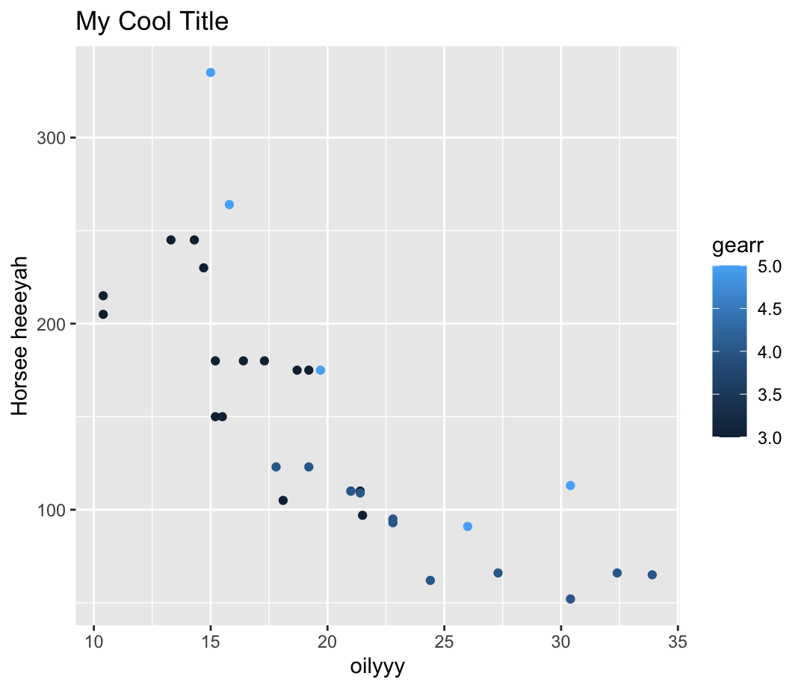

```{r setup, include=FALSE}
knitr::opts_chunk$set(echo = TRUE)
```

## R Markdown

This is an R Markdown document. Markdown is a simple formatting syntax for authoring HTML, PDF, and MS Word documents. For more details on using R Markdown see <http://rmarkdown.rstudio.com>.

When you click the **Knit** button a document will be generated that includes both content as well as the output of any embedded R code chunks within the document. You can embed an R code chunk like this:

```{r cars}
summary(cars)
```

## Including Plots

You can also embed plots, for example:


Note that the `echo = FALSE` parameter was added to the code chunk to prevent printing of the R code that generated the plot.


```{r participant_data}
participant_data <-  read.csv('participants_data.csv')

str(participant_data)
```

## plot distance to work

```{r pressure, echo=FALSE}
plot(participant_data$km_home_to_office)
```

```{r, figures-side, fig.show="hold", out.width="50%"}
par(mar = c(4, 4, .1, .1))
plot(participant_data$age)
plot(participant_data$km_home_to_office)
dev.off()
```
##Include Figure
```{r}

```


##Emphasis

 _bold_
 
 _Italic_
 
 `r_code`
 
## Headers
 
# Header 1

## Header 2

### Header 3

#### Header 4

## List

### Unordered list

* Item 1
* Item 2
    + Item 2a
    + Item 2b

    
### Ordered List

1. Item 1
2. Item 2
3. Item 3
    + Item 3a
    + Item 3b
    
```{r}
summary(cars$dist)
summary(cars$speed)
```

## Inline R Code

There were `r nrow(cars)` cars studied

## Links

https://twitter.com/ddang_baby

[ddang_baby](https://twitter.com/ddang_baby)

## Blockscode

A friend once said:

> It's always better to give
> than to receive.

## Plain Code Block

```
This text is displayed verbatim / preformatted
```

## Inline Code

We defined the `add` function to
compute the sum of two numbers.

## LaTeX Equations

**Inline equation:**

$equation$

**Display equation:**

$$ equation $$

## Horizontal Rule / Page Break

******

------

## Table

Not Recommended  | To Do
------------- | -------------
Gernerate  | Somewhere else
Thanks  | Bye
Reference Style Links and Images

## Manual Line Break

Enad a line with  two or more space  
otherwise it all goes on the same line  
Thanks

Roses are red,  
Violets <sub>are <span style="color: blue;"> blue</span> </sub>

## Miscellaneous
superscript^2^

~~strikethrough~~


